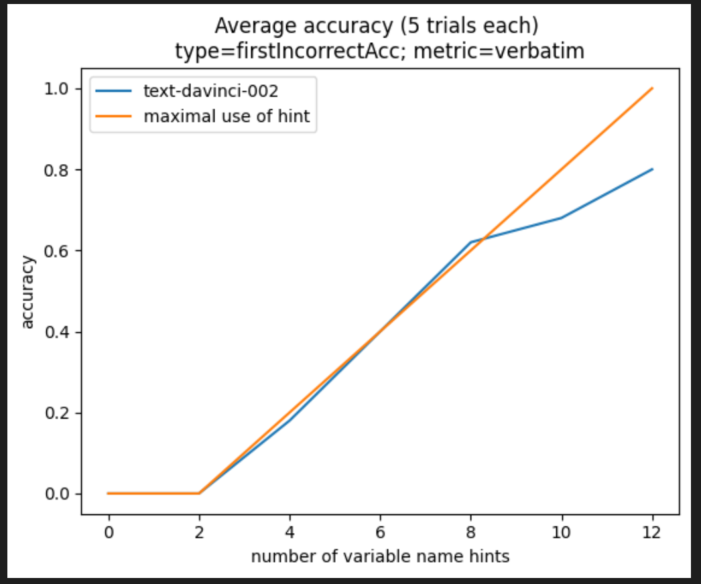
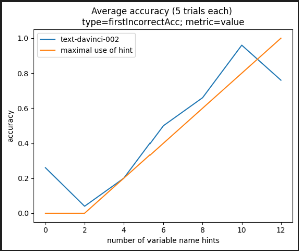
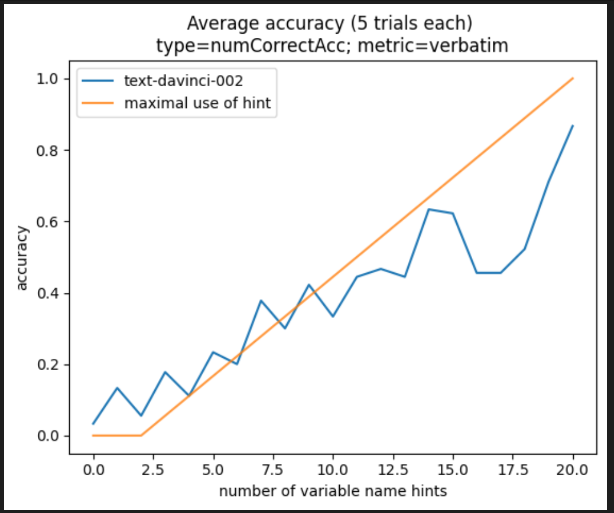

## Goal

We argue that GPT-3 relies on simple attention patterns like the [Induction Head](https://transformer-circuits.pub/2022/in-context-learning-and-induction-heads/index.html) to solve reasoning tasks.
We show that GPT-3 uses a consistent attention pattern to solve the [LEGO reasoning task](https://arxiv.org/pdf/2206.04301.pdf), regardless of the size, syntax, or scrambling of the input.

We hope to reverse-engineer GPT's attention pattern on this task, and make it human-interpretable. 

## Results

We find that GPT-3's performance scales linearly with the length of the hint it is given, independent of the size, syntax, or scrambling. 

## Cases

We test the following cases:

- Using various problem sizes (12, 16, and 20 variables)

- Adding spaces and commas between tokens

- Using words as variable names

- Padding the equals sign in the hint

- Padding the equals sign in the system of equations

## Contributors

- Mathew Pareles
- Advised by Prof. Michael Douglas, Harvard / SCGP
