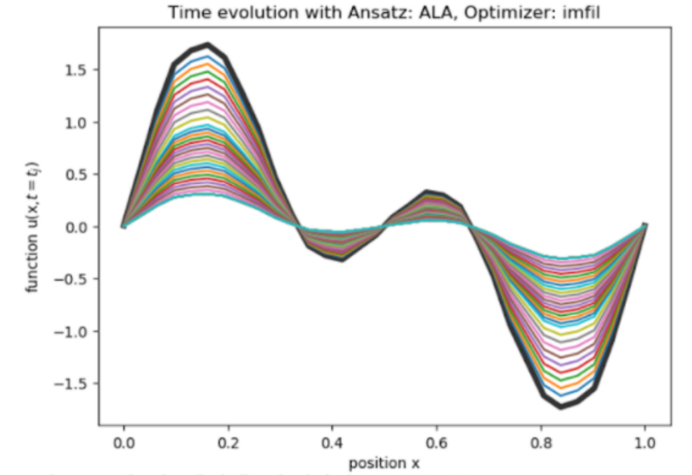

## Simulating PDEs on a Quantum Computer

This repository contains research on using IBM's Quantum Computer to simulate PDEs. We solved the Heat Equation (left) accurately on a quantum computer. The Advection Equation (right) cannot be solved accurately due to discretization errors. 

One can solve both of these equations using the same quantum circuits, and we talk about extending these simulations to the Inviscid Burger's Equation and other PDEs in general, with applications in finance.
