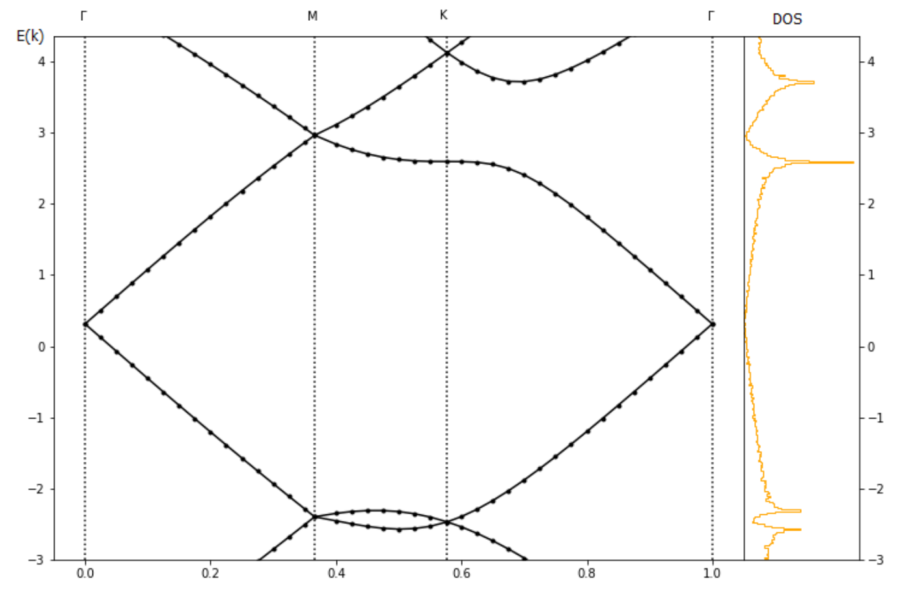
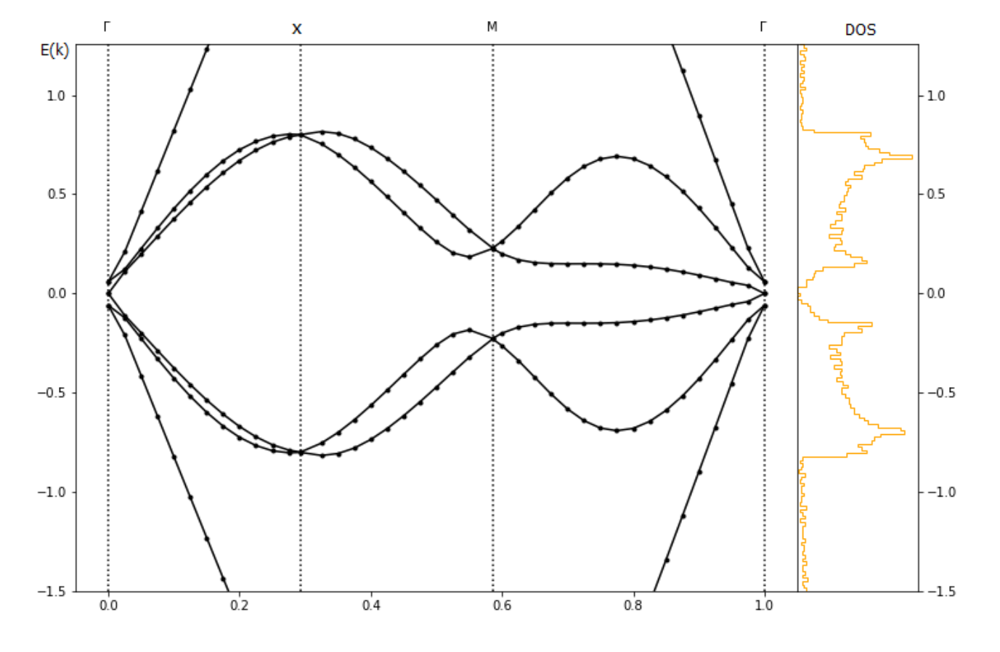
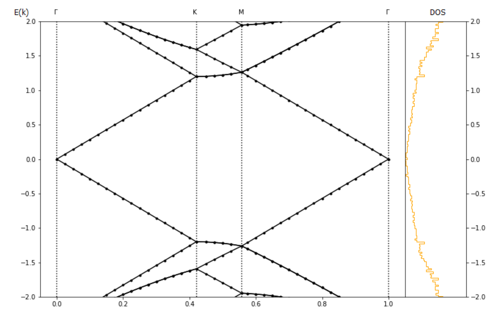
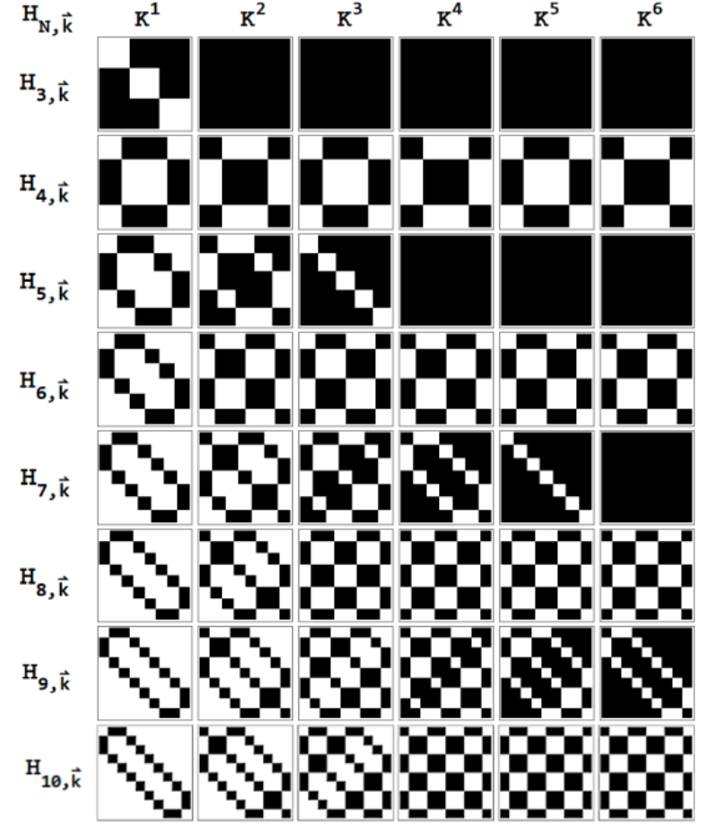

## Superconductivity Research

In this repository, we use computational methods to show that rotationally symmetric materials (topological insulators) can more easily create the conditions for superconductivity than arbitrary materials.
Here are some rotationally symmetric materials, drawn in Reciprocal Space.

We show that one can create spikes in the density of states (DOS) by simply tuning the strength of the superpotential. This can lead to instabilities in the material, including superconductivity. Here are some of the simulations in this repository.

<!--  -->

We accurately calculate the Energy Spectrum of the material by using Perturbation Theory. Here are some of the resulting matrices:

